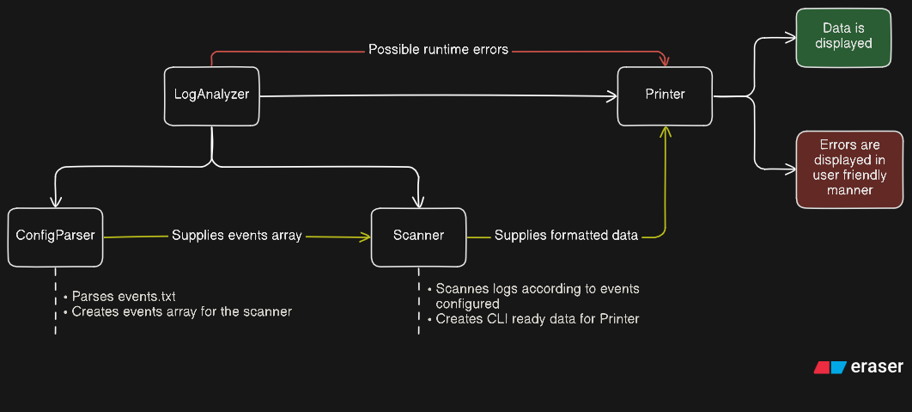

# Logy - Your personal log analyzer

Logy is a lightweight log analyzer, with event based log parsing.

Supports `.log` files and `.log.gz` compressed files.

## Running

To see Logy's input options, simply run:

```sh
python LogAnalyzer.py -h
```

And a comprehensive introduction will be displayed.

## Tests

To run the unit tests:

```sh
python -m unittest discover -s tests -v
```

## Solution implementation


Before starting the project, I've read through the instructions to plan ahead.

What resulted is a basic sketch of the project's architecture:

The main file is `LogAnalyzer.py`. It's responsible for executing the main flow of the project.

##### Program's flow

1. Arguments are parsed from the user
2. `ConfigParser.py` parses the supplied events file to assemble an array of `Event` objects
3. Said array is passed over to `Scanner.py`
4. `Scanner.py` filters logs based on provided events, and styles the data for CLI
5. Styled data is passed to `Printer.py`, which handles all of the program's print statements

##### Error handling

The program performs extensive error checking, and uses the `Printer.py` to print detected errors in a user friendly way.

For example, a **regex error** in the events file will result in:

```
Oops! It seems like the config file contains invalid regex!

-------------------------------------------
GNMI --pattern ([A-Z]{3,5}?+) --level ERROR
-------------------------------------------

Please fix config file and try again.
```
